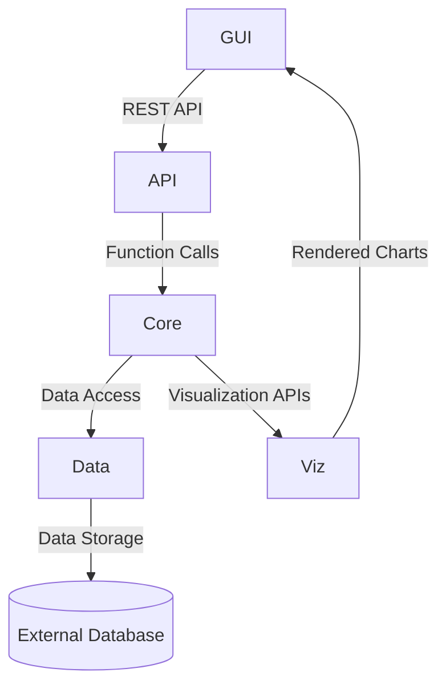

# Project Architecture Documentation

## Overall System Architecture

The Phoenix Financial Analysis system is structured into the following modules:

1. **API Module**:
   - Located in `pheonix/src/api/`
   - Provides RESTful endpoints for external interaction.
   - Built using FastAPI.

2. **Core Module**:
   - Located in `pheonix/src/core/`
   - Contains the business logic, including analytics, graph processing, and LLM-related functionalities.

3. **Data Module**:
   - Located in `pheonix/src/data/`
   - Handles data ingestion, schema definitions, and transformations.

4. **GUI Module**:
   - Located in `pheonix/src/gui/`
   - Implements the user interface for interacting with the system.

5. **Utils Module**:
   - Located in `pheonix/src/utils/`
   - Provides utility functions and shared helpers.

6. **Viz Module**:
   - Located in `pheonix/src/viz/`
   - Responsible for data visualization and dashboard generation.

## Interfaces Between Modules

1. **API to Core**:
   - The API module interacts with the Core module to process user requests and return results.
   - Interface: Function calls and data contracts defined in `core`.

2. **Core to Data**:
   - The Core module fetches and processes data using the Data module.
   - Interface: Data access methods in `data`.

3. **Core to Viz**:
   - The Core module sends processed data to the Viz module for visualization.
   - Interface: Visualization APIs in `viz`.

4. **GUI to API**:
   - The GUI module communicates with the API module to fetch data and display results.
   - Interface: RESTful endpoints exposed by the API module.

5. **Shared Utilities**:
   - All modules can use shared utilities from the Utils module.

## Data Flow Diagram

This diagram illustrates the flow of data from the user interface through the API and Core modules, interacting with the Data module and external databases, and finally rendering visualizations in the GUI.